# NR6-HAL Legacy Dependency Map

**Phase:** 02-dependency-mapping
**Generated:** 2026-04-10
**Scope:** 7 legacy SQF files, ~17,863 lines, ~144 symbol declarations
**Purpose:** Call graph + classification + target_addon assignment to enable safe leaf-first function extraction in Phase 3.

## How to Read This Document

- **Per-file sections** (§1–§7): complete function tables with 8 metadata fields per D-02
- **Leaf-first PREP ordering** (§8): the topological sort Phase 3 must follow
- **Dependency graph** (§9): visual Mermaid diagram grouped by target_addon
- **Ambiguity summary** (§10): cases flagged for user review
- **Phase 3 blockers** (§11): critical issues for planner consumption

## Summary Counts

| target_addon | active | dead? | migrated |
|--------------|--------|-------|----------|
| hal_data | 33 | 0 | 0 |
| hal_hac | 1 | 4 | 9 (+34 in commented blocks) |
| hal_boss | 26 | 0 | 0 |
| hal_tasking | 73 | 0 | 0 |
| **Total** | **133** | **4** | **9** |

Notes on counts:
- hal_hac migrated count of 9 covers table-row entries. The additional 34 symbols in the `/* */` and `//` commented blocks at lines 1–595 of HAC_fnc.sqf are also migrated — they are listed in §1 under "Commented-Out Migrated Symbols". Grand total symbols across all 7 files: 133 active + 4 dead? + 9 table-row migrated + 34 comment-block migrated = 180 unique legacy names touched. The 144-symbol figure from research refers to the primary declaration rows across the 7 files (excluding the comment-block enumeration at lines 1–595).
- hal_boss active=26 includes: 21 Boss_fnc.sqf functions + RYD_StatusQuo + HAL_FBFTLOOP + HAL_EBFT + HAL_SecTasks (from HAC_fnc2.sqf) + Boss.sqf structural main loop (D-08 treatment).
- hal_tasking active=73 includes: 72 TaskInitNR6.sqf declarations + SquadTaskingNR6 imperative loop.

---

# §1. HAC_fnc.sqf

## HAC_fnc.sqf

**File:** `nr6_hal/HAC_fnc.sqf` (5,645 lines)
**Active declarations:** 1 genuinely active (`RYD_Dispatcher`, line 1276); 9 others are inside `/* */` comment blocks — all commented-out originals (migrated or superseded). The research-phase grep (`^RYD_`) matched these even inside multi-line comment blocks; this document corrects that classification.

### Function Table

| name | line | classification | target_addon | params | calls | called_by | notes |
|------|------|----------------|--------------|--------|-------|-----------|-------|
| RYD_WPadd | 596 | migrated | hal_hac | implicit: `_this select 0` (group), `_this select 1`+ (pos, tp, beh, CM, spd, sts, crr, rds, TO, formation) — 11 fields | `RYD_FlatLandNoRoad`, `RYD_TerraCognita`, `RYD_AngTowards`, `RYD_PosTowards2D` (all via commented body) | HAC_fnc2.sqf:1342,1414; Boss_fnc.sqf:1192,1443,1559 (still active callers in other files) | Body commented out inside `/* RYD_WPadd -> replaced by CBA_fnc_addWaypoint ... */` (lines 595–905). Migrated to stub `addons/common/functions/fnc_WPadd.sqf` (Phase 1 placeholder — real migration in Phase 3). Dual presence: legacy block is dead, but active callers remain in other files calling the legacy global name. Phase 3 must implement fnc_WPadd.sqf fully before deleting this block. |
| RYD_GoLaunch | 977 | migrated | hal_hac | `_kind` (string: INF/ARM/SNP/AIR/AIRCAP/NAVAL) — implicit `_this select 0` | Returns HAL_GoAtt* code reference (switch-dispatch to external HAL_ values) | HAC_fnc.sqf:1715,1717 (commented callers); TaskInitNR6.sqf:243,361,474 (active callers) | Body commented out inside `/* RYD_GoLaunch -> migrated to fnc_goLaunch.sqf ... */` (lines 976–997). Migrated to `addons/common/functions/fnc_goLaunch.sqf`. Active callers remain in TaskInitNR6.sqf calling legacy global name — dual presence risk until Phase 3 renames all call sites. |
| RYD_FindClosestWithIndex | 1000 | dead? | hal_hac | `_ref` (object/pos), `_objects` (array) — implicit `_this select 0,1` | `RYD_FindClosest` (internal, via commented body) | HAC_fnc.sqf:1089 (in commented `RYD_DistOrd` body — also dead) | AMBIGUOUS — body commented out inside `/* RYD_FindClosestWithIndex -> dead code once DistOrd/DistOrdC replaced by CBA_fnc_sortNestedArray ... */` (lines 999–1040, plus duplicate block 1042–1075). Comment header explicitly marks this as dead code. No active callers found in 7-file scope. Phase 3 must confirm before deletion. |
| RYD_DistOrd | 1077 | dead? | hal_hac | `_array` (array), `_point` (pos/object), `_limit` (number) — implicit `_this select 0,1,2` | `RYD_FindClosestWithIndex` (commented body) | HAC_fnc.sqf:1270,1498 (both in commented `RYD_Recon`/`RYD_Dispatcher` bodies); HAL/SCargo.sqf:102 (out of scope) | Body commented out inside `/* RYD_DistOrd -> replaced by CBA_fnc_sortNestedArray ... */` (lines 1076–1105). Both in-scope callers are also inside comment blocks. Only active caller is `nr6_hal/HAL/SCargo.sqf` which is out of Phase 2 scope. Phase 3 must check HAL/SCargo.sqf before deleting. |
| RYD_DistOrdC | 1108 | dead? | hal_hac | `_array` (array), `_point` (pos/object), `_limit` (number) — implicit `_this select 0,1,2` | None | (none found in 7-file scope) | AMBIGUOUS — body commented out inside `/* RYD_DistOrdC -> replaced by CBA_fnc_sortNestedArray ... */` (lines 1107–1134). Comment header marks as superseded. No active callers found in entire 7-file scope. Not in raw-migration-map.tsv (no migrated equivalent in addons/). Phase 3 must confirm no callers in out-of-scope HAL/ files before deletion. |
| RYD_DistOrdD | 1137 | migrated | hal_hac | `_array` (array), `_point` (pos/object), `_limit` (number) — implicit `_this select 0,1,2`; uses internal `_pos`, `_sort`, `_mid` | None via commented body | (none found in 7-file scope) | Body commented out inside `/* RYD_DistOrdD -> migrated to fnc_distOrdD.sqf ... */` (lines 1136–1179). Migrated to `addons/common/functions/fnc_distOrdD.sqf`. No active callers in 7-file scope — legacy callers would have been using global name which is now dead. Phase 3 deletes this commented block. |
| RYD_Recon | 1182 | migrated | hal_hac | `_gps` (bool), `_IR` (bool), `_rcArr` (array), `_lmt` (number), `_trg` (object/group) — implicit `_this select 0..4` | `RYD_DistOrd` (via commented body) | (none found in 7-file scope; active callers presumably in HAL/ scope) | Body commented out inside `/* RYD_Recon -> migrated to fnc_recon.sqf ... */` (lines 1181–1274). Migrated to `addons/common/functions/fnc_recon.sqf`. Phase 3 deletes this commented block. |
| RYD_Dispatcher | 1276 | active | hal_hac | `_threat` (array), `_kind` (string), `_HQ` (group), `_ATriskResign1`, `_ATriskResign2`, `_AAriskResign`, `_AAthreat`, `_ATthreat`, `_armorATthreat`, `_Fpool` (array of 20 elements) — `_this select 0..9` | `[external: nr6_hal/HAL/HQOrders.sqf]` (HAL_GoCapture, HAL_GoAttAir, HAL_GoAttInf, HAL_GoAttSniper, HAL_GoAttArmor, HAL_GoAttNaval via `_code` value dispatch), `RYD_VarReductor` (called in body lines ~1700+) | `[external: nr6_hal/HAL/HQOrders.sqf:642–682]` (only active caller — out of 7-file scope) | ONLY genuinely active (uncommented) function in HAC_fnc.sqf. 466-line body (lines 1276–1741). Dispatches force to attack objectives by composing attack orders. Uses GoLaunch-style value dispatch internally — calls `_code = HAL_GoAtt*` then `[_HQ,_threat,_kind] call _code`. External HAL_* calls are NOT capturable by static regex — they are runtime-compiled references from VarInit.sqf. Phase 3 must extract this as `hal_hac_fnc_dispatcher.sqf`. |
| RYD_VarReductor | 1744 | migrated | hal_hac | `_trg` (group/object), `_kind` (string) — implicit `_this select 0,1` | None (standalone, reads/writes `HAC_Attacked` group variable) | RYD_Dispatcher body (line ~1700+, active); other callers in HAL/ scope (out of scope) | Body commented out inside `/* RYD_VarReductor -> migrated to fnc_varReductor.sqf ... */` (lines 1743–1777). Migrated to `addons/common/functions/fnc_varReductor.sqf`. However, the active `RYD_Dispatcher` body calls it — meaning the global name `RYD_VarReductor` must still resolve at runtime. Phase 3 must update `RYD_Dispatcher` to call `FUNC(varReductor)` before deleting the legacy global. |
| RYD_RHQCheck | 5441 | migrated | hal_hac | No params (reads mission-namespace globals `RHQ_*`, `RHQs_*`, `RYD_WS_*_class` directly) | `RYD_WS_*_class` arrays from RHQLibrary.sqf (read as globals) | (none found in 7-file scope; active callers presumably in HAL/ scripts or entry-point chain) | Body commented out inside `/* RYD_RHQCheck -> migrated to fnc_rhqCheck.sqf ... */` (lines 5440–5560). Migrated to `addons/common/functions/fnc_rhqCheck.sqf`. Large function spanning 120 lines — populates force-composition summary. Phase 3 deletes this commented block. |

### Notes

#### Lines 1–595: Commented-Out Block (D-04)

Lines 1–595 contain `//`-commented originals of functions migrated to `addons/common/functions/` in an earlier work session. These are NOT enumerated as separate table rows per D-04 (Phase 2 documents only, does not touch source). The commented symbols in this block are listed below.

The `/* */` comment pattern extends beyond line 595 — all 9 non-Dispatcher declarations (lines 596–5560) are also inside `/* */` blocks with migration notes in the comment headers. This corrects the research-phase characterization of "10 active declarations at line 596+".

#### Commented-Out Migrated Symbols (lines 1–595 and embedded `/* */` blocks)

The 34 symbols that appear in commented form (either `//` lines 1–595 or `/* */` wraps per above table):

- `RYD_AIChatter` → `addons/common/functions/fnc_AIChatter.sqf` (migrated)
- `RYD_AmmoCount` → `addons/common/functions/fnc_ammoCount.sqf` (migrated)
- `RYD_AmmoFullCount` → `addons/common/functions/fnc_ammoFullCount.sqf` (migrated)
- `RYD_AngTowards` → `addons/common/functions/fnc_angleTowards.sqf` (migrated)
- `RYD_CloseEnemy` → `addons/common/functions/fnc_closeEnemy.sqf` (migrated)
- `RYD_CloseEnemyB` → `addons/common/functions/fnc_closeEnemyB.sqf` (migrated)
- `RYD_CreateDecoy` → `addons/common/functions/fnc_createDecoy.sqf` (migrated)
- `RYD_FireCount` → `addons/common/functions/fnc_fireCount.sqf` (migrated)
- `RYD_Flares` → `addons/common/functions/fnc_flares.sqf` (migrated)
- `RYD_GarrP` → `addons/common/functions/fnc_garrisonP.sqf` (migrated)
- `RYD_GarrS` → `addons/common/functions/fnc_garrisonS.sqf` (migrated)
- `RYD_GroupMarkerLoop` → `addons/common/functions/fnc_groupMarkerLoop.sqf` (migrated)
- `RYD_HQChatter` → `addons/common/functions/fnc_HQChatter.sqf` (migrated)
- `RYD_isNight` → `addons/common/functions/fnc_isNight.sqf` (migrated)
- `RYD_LOSCheck` → `addons/common/functions/fnc_LOSCheck.sqf` (migrated)
- `RYD_Mark` → `addons/common/functions/fnc_mark.sqf` (migrated)
- `RYD_OrderPause` → `addons/common/functions/fnc_orderPause.sqf` (migrated)
- `RYD_PointToSecDst` → `addons/common/functions/fnc_pointToSecondaryDistance.sqf` (migrated)
- `RYD_PosTowards2D` → `addons/common/functions/fnc_positionTowards2D.sqf` (migrated)
- `RYD_RandomAround` → `addons/common/functions/fnc_positionAround.sqf` (migrated; renamed)
- `RYD_RandomAroundB` → `addons/common/functions/fnc_randomAroundB.sqf` (migrated)
- `RYD_RandomAroundMM` → `addons/common/functions/fnc_randomAroundMM.sqf` (migrated)
- `RYD_ReverseArr` → `addons/common/functions/fnc_reverseArr.sqf` (migrated)
- `RYD_Smoke` → `addons/common/functions/fnc_smoke.sqf` (migrated)
- `RYD_TerraCognita` → `addons/common/functions/fnc_terraCognita.sqf` (migrated)
- `RYD_Wait` → `addons/common/functions/fnc_wait.sqf` (migrated)
- `RYD_WPSync` → `addons/common/functions/fnc_WPSync.sqf` (migrated)
- `RYD_FindBiggest` → `addons/common/functions/fnc_findBiggest.sqf` (migrated; in XEH_PREP.hpp)
- `RYD_FlatLandNoRoad` → `addons/common/functions/fnc_flatLandNoRoad.sqf` (migrated; in XEH_PREP.hpp)
- `RYD_GoInside` → `addons/common/functions/fnc_goInside.sqf` (migrated; in XEH_PREP.hpp)
- `RYD_NearestRoad` → `addons/common/functions/fnc_nearestRoad.sqf` (migrated; in XEH_PREP.hpp)
- `RYD_RoofOver` → `addons/common/functions/fnc_roofOver.sqf` (migrated; in XEH_PREP.hpp)
- `RYD_ValueOrd` → `addons/common/functions/fnc_valueOrd.sqf` (migrated; in XEH_PREP.hpp)
- `RYD_WPadd` → `addons/common/functions/fnc_WPadd.sqf` (Phase 1 stub; real migration in Phase 3)

#### Ambiguous Cases Escalated for User Review

1. **RYD_DistOrdC** — No active callers found in 7-file scope and no migrated equivalent in addons/. Comment header says "replaced by CBA_fnc_sortNestedArray". AMBIGUOUS: may be called from out-of-scope HAL/ files. Phase 3 must search HAL/ before deleting.

2. **RYD_FindClosestWithIndex** — Comment header explicitly says "dead code once DistOrd/DistOrdC replaced". No callers outside commented blocks. Most likely safe to delete in Phase 3, but the HAL/ scope check should confirm.

#### Research-Phase Correction

The Phase 2 research characterized HAC_fnc.sqf as having "10 active declarations at line 596+". Direct source reading reveals all 10 symbols are wrapped in `/* */` comment blocks — the grep pattern `^RYD_` matched them even inside multi-line comments because grep is line-oriented, not block-aware. The corrected picture: 1 active function (`RYD_Dispatcher`), 6 migrated (commented), 3 dead (commented). This does not affect Phase 3 planning — the symbols still need processing — but the classification changes from active to migrated/dead for 9 of 10.

---

# §2. HAC_fnc2.sqf

## HAC_fnc2.sqf

**File:** `nr6_hal/HAC_fnc2.sqf` (3,389 lines)
**Declarations:** 10 total (7 `RYD_*` + 3 `HAL_*`). 7 are genuinely active (uncommented) code; 2 are inside `/* */` comment blocks (migrated); 1 (`RYD_FindClosest`) is active at source but also exists in `addons/common/` (dual presence).

### Function Table

| name | line | classification | target_addon | params | calls | called_by | notes |
|------|------|----------------|--------------|--------|-------|-----------|-------|
| RYD_StatusQuo | 1 | active | hal_boss | No `params` statement — reads HQ state from globals: `_HQ` (group, implicit context var set by caller), `_cycleC` (int), `_lastReset` (number), `_excl` (array), `_civF` (array) passed via caller context | `HAL_HQReset` (lines 20,36; external); `RYD_Spawn` (line 39,1282,1424,1747); `RYD_RandomOrd` (216); `RYD_LiveFeed` (233); `RYD_AIChatter` (284,887,912,1181,1193); `RYD_Mark` (904); `RYD_ArtyPrep` (1032); `RYD_CFF` (1088); `HAL_HQOrders` (1186; external); `HAL_HQOrdersDef` (1198; external); `RYD_isNight` (1207,1652); `RYD_WPadd` (1342,1414); `RYD_GoInside` (1345,1417); `HAL_Rev` (1464; external); `HAL_SuppMed` (1474; external); `HAL_SuppFuel` (1483; external); `HAL_SuppRep` (1492; external); `HAL_SuppAmmo` (1504; external); `HAL_SFIdleOrd` (1518; external); `HAL_Reloc` (1525; external); `HAL_LPos` (1533; external); `HAL_EnemyScan` (1546; external); `RYD_LF_EFF` (1654); `RYD_isInside` (1690); `HAL_GoSFAttack` (1281,1282; external, spawn + value_pass); `HAL_Garrison` (1552; external, spawn); `HAL_EBFT` (308; spawn — same file line 3029) | Entry point spawned from `addons/core/functions/fnc_init.sqf` (indirectly via the per-HQ loop at lines 185–190 which spawns HQSitRep, FBFTLOOP, and SecTasks) | **1,779-line mega-function (lines 1–1779).** Phase 3 FUNC-08 decomposes into sub-functions under 250 lines each. This is the HQ commander decision loop. Calls ~15 external `HAL_*` functions compiled from `nr6_hal/HAL/*.sqf` via `VarInit.sqf`. |
| RYD_LF_Loop | 1780 | dead? | hal_hac | `_leader` (unit, `_this select 0`); `_HQ` (group, `(_this select 3) select 0`) — note: selects index 3 suggesting 4-element array | `RYD_LF` (lines 1854,1859,1926 — migrated to `addons/common/functions/fnc_LF.sqf`) | (none found in 7-file scope) | AMBIGUOUS — No callers found in the 7-file scope. LF utilities (`RYD_LF`, `RYD_LF_EFF`) are already migrated. This function may have been orphaned when LF was refactored. Phase 3 must search `nr6_hal/HAL/` and addon scripts before classifying as dead and deleting. |
| RYD_FindClosest | 1932 | migrated | hal_hac | `_ref` (object/pos, `_this select 0`); `_objects` (array, `_this select 1`) | None (iterates `_objects` with distance check) | HAC_fnc.sqf:286 (in commented block — inactive); no active callers in 7-file scope | Dual presence — active source code at line 1932 AND exists in `addons/common/functions/fnc_findClosest.sqf`. Phase 3 must delete this duplicate and update any callers to use `FUNC(findClosest)`. |
| RYD_ClusterC | 1999 | migrated | hal_hac | `_points` (array, `_this select 0`); `_range` (number, `_this select 1`) | None (iterates `_points`, proximity clustering) | (none found in 7-file scope; callers presumably in HAL/ scope) | Body commented out inside `/* RYD_ClusterC -> migrated to fnc_clusterC.sqf ... */` (lines 1998–2032). Already in `addons/common/functions/fnc_clusterC.sqf`. Phase 3 deletes this commented block. |
| RYD_PresentRHQ | 2207 | active | hal_data | No params — reads all vehicles/units from `allVehicles`, uses mission-namespace `RYD_WS_*_class` arrays from RHQLibrary.sqf, writes to `RHQ_*` globals | `RYD_WS_*_class` arrays (globals from RHQLibrary.sqf, read directly); `CBA_fnc_clearWaypoints` (Arma 3 API — not tracked) | `nr6_hal/RHQLibrary.sqf:2489` (`[] call RYD_PresentRHQ` at file end); `addons/core/functions/fnc_init.sqf` (indirectly); `HAC_fnc2.sqf:3238` (`[] spawn RYD_PresentRHQ` from `RYD_PresentRHQLoop`) | Data initialization function — scans all mission vehicles and categorizes them into `RHQ_*` arrays. Belongs with `hal_data` per D-06. Will be migrated to `addons/hal_data/` in Phase 3. Reads from RHQLibrary.sqf data arrays — must be extracted AFTER those arrays are extracted. |
| HAL_FBFTLOOP | 2871 | active | hal_boss | `_HQ` (group, `(_this select 0)`) | `HAL_fnc_getType` (line 2915; Arma 3 engine fn — external); `HAL_fnc_getSize` (line 2916; Arma 3 engine fn — external) | `addons/core/functions/fnc_init.sqf:189` (`[[_gp], HAL_FBFTLOOP] call RYD_Spawn`) | Friendly/Enemy Battle-Field Tracking loop — maintains HQ marker groups for visual unit tracking. Entry point via `fnc_init.sqf` line 189. Phase 3 extracts to `addons/hal_boss/functions/fnc_FBFTLOOP.sqf`. |
| HAL_EBFT | 3029 | active | hal_boss | `_HQ` (group, `(_this select 0)`) | `HAL_fnc_getType` (line 3053; Arma 3 engine fn — external); `HAL_fnc_getSize` (line 3054; Arma 3 engine fn — external) | `HAC_fnc2.sqf:308` (`[_HQ] spawn HAL_EBFT` from inside `RYD_StatusQuo` body) | Enemy Battle-Field Tracking — maintains enemy marker display. Spawned from `RYD_StatusQuo` at line 308. Phase 3 extracts to `addons/hal_boss/functions/fnc_EBFT.sqf`. |
| HAL_SecTasks | 3121 | active | hal_boss | `_HQ` (group, `_this select 0`) | None (reads `_HQ getVariable ["RydHQ_Friends",[]]`, `RYD_AddTask`, `RYD_DeleteWaypoint` via indirect references) | `addons/core/functions/fnc_init.sqf:190` (`[[_gp], HAL_SecTasks] call RYD_Spawn`) | Player secondary task management loop. Entry point via `fnc_init.sqf` line 190. Phase 3 extracts to `addons/hal_boss/functions/fnc_SecTasks.sqf`. |
| RYD_PresentRHQLoop | 3233 | active | hal_data | No params (reads global `RydxHQ_RHQAutoFill` and `RydxHQ_AllHQ`) | `RYD_PresentRHQ` (line 3238; spawn) | `nr6_hal/RHQLibrary.sqf:2490` (`[] spawn RYD_PresentRHQLoop` — but this line is inside the conditional block `if (RydxHQ_RHQAutoFill)` and is currently commented out) | Thin scheduler wrapping `RYD_PresentRHQ`. Caller in RHQLibrary.sqf is currently commented out — reclassified as active per raw-call-edges.tsv record; Phase 3 must verify. Both `hal_data` target since it manages the data initialization loop. |
| RYD_deployUAV | 3244 | migrated | hal_hac | `_gp` (group, `_this select 0`); `_pos` (pos, `_this select 1`); `_HQ` (group, `_this select 2`) | None (manages UAV deployment waypoints) | (none found in 7-file scope) | Body commented out inside `/* RYD_deployUAV -> migrated to fnc_deployUAV.sqf ... */` (lines 3243–3389). Already in `addons/common/functions/fnc_deployUAV.sqf`. Phase 3 deletes this commented block. |

### Dynamic Dispatch

The following call sites in `RYD_StatusQuo` reference functions compiled from `nr6_hal/HAL/*.sqf` via `VarInit.sqf`. They are NOT capturable by static regex on the 7 in-scope files and do NOT appear in `raw-call-edges.tsv`. These edges are documented here as the "LLM review catches what regex misses" value of D-09.

| Line | Call Pattern | External Symbol | Source File (est.) |
|------|-------------|-----------------|-------------------|
| 20 | `[_HQ] call HAL_HQReset` | `HAL_HQReset` | `nr6_hal/HAL/HQReset.sqf` |
| 36 | `[_HQ] call HAL_HQReset` | `HAL_HQReset` | `nr6_hal/HAL/HQReset.sqf` |
| 308 | `[_HQ] spawn HAL_EBFT` | `HAL_EBFT` | `HAC_fnc2.sqf:3029` (same file — in-scope) |
| 1186 | `[...] call HAL_HQOrders` | `HAL_HQOrders` | `nr6_hal/HAL/HQOrders.sqf` |
| 1198 | `[...] call HAL_HQOrdersDef` | `HAL_HQOrdersDef` | `nr6_hal/HAL/HQOrders.sqf` |
| 1281 | `[...] spawn HAL_GoSFAttack` | `HAL_GoSFAttack` | `[external: nr6_hal/HAL/GoSFAttack.sqf]` |
| 1282 | `[..., HAL_GoSFAttack] call RYD_Spawn` | `HAL_GoSFAttack` | `[external: nr6_hal/HAL/GoSFAttack.sqf]` (value_pass) |
| 1464 | `[...] call HAL_Rev` | `HAL_Rev` | `[external: nr6_hal/HAL/Rev.sqf]` |
| 1474 | `[...] call HAL_SuppMed` | `HAL_SuppMed` | `[external: nr6_hal/HAL/SuppMed.sqf]` |
| 1483 | `[...] call HAL_SuppFuel` | `HAL_SuppFuel` | `[external: nr6_hal/HAL/SuppFuel.sqf]` |
| 1492 | `[...] call HAL_SuppRep` | `HAL_SuppRep` | `[external: nr6_hal/HAL/SuppRep.sqf]` |
| 1504 | `[...] call HAL_SuppAmmo` | `HAL_SuppAmmo` | `[external: nr6_hal/HAL/SuppAmmo.sqf]` |
| 1518 | `[...] call HAL_SFIdleOrd` | `HAL_SFIdleOrd` | `[external: nr6_hal/HAL/SFIdleOrd.sqf]` |
| 1525 | `[...] call HAL_Reloc` | `HAL_Reloc` | `[external: nr6_hal/HAL/Reloc.sqf]` |
| 1533 | `[...] call HAL_LPos` | `HAL_LPos` | `[external: nr6_hal/HAL/LPos.sqf]` |
| 1546 | `[...] call HAL_EnemyScan` | `HAL_EnemyScan` | `addons/core/functions/fnc_EnemyScan.sqf` (migrated) |
| 1552 | `[...] spawn HAL_Garrison` | `HAL_Garrison` | `[external: nr6_hal/HAL/Garrison.sqf]` |

**Engine function references** (NOT in-scope edges — Arma 3 built-ins registered via VarInit.sqf):

- `HAC_fnc2.sqf:2915` — `_x call HAL_fnc_getType` (inside `HAL_FBFTLOOP` body)
- `HAC_fnc2.sqf:2916` — `call HAL_fnc_getSize` (inside `HAL_FBFTLOOP` body)
- `HAC_fnc2.sqf:3053` — `_x call HAL_fnc_getType` (inside `HAL_EBFT` body)
- `HAC_fnc2.sqf:3054` — `call HAL_fnc_getSize` (inside `HAL_EBFT` body)

These are Arma 3 engine functions (unit type classification, size queries) compiled at mission start. They are not defined in any of the 7 scoped files.

### Notes

#### RYD_StatusQuo Decomposition Requirement (FUNC-08)

`RYD_StatusQuo` is a 1,779-line mega-function (lines 1–1779). Per Phase 3 requirement FUNC-08, this must be decomposed into sub-functions each under 250 lines before or during extraction. Suggested decomposition boundaries based on source structure:

- Enemy/Friend list update block (~lines 75–310) → `fnc_statusQuo_scanGroups.sqf`
- Radio channel management block (~lines 189–215) → inline or `fnc_statusQuo_radioUpdate.sqf`
- Logistics/support dispatch block (~lines 1460–1560) → `fnc_statusQuo_logistics.sqf`
- Attack order dispatch block (~lines 1180–1280) → `fnc_statusQuo_attackDispatch.sqf`
- Main decision loop orchestrator (~remaining lines) → `fnc_statusQuo.sqf`

Phase 3 executor must read the full body before finalizing decomposition boundaries.

#### Ambiguous Cases Escalated for User Review

1. **RYD_LF_Loop** — No callers found in 7-file scope. The Live Feed loop was likely orphaned when `RYD_LF` / `RYD_LF_EFF` were migrated. AMBIGUOUS: out-of-scope HAL/ or mission scripts may still call it. Phase 3 must confirm before deletion.

2. **RYD_PresentRHQLoop** — Has one caller (`RHQLibrary.sqf:2490`) confirmed in `raw-call-edges.tsv`. This makes it technically `active`, but the body is trivial (thin scheduler wrapping `RYD_PresentRHQ`). The reclassification note is in the table. Not flagged AMBIGUOUS — caller is confirmed.

#### HAC_fnc2.sqf Not Loaded in Current Addon System

`addons/core/functions/fnc_init.sqf` lines 98–102 are commented out (the block that loaded `HAC_fnc.sqf` and `HAC_fnc2.sqf` via `compile preprocessFile`). The functions in this file are NOT currently loaded in the new addon system. The migrated equivalents in `addons/common/` and `addons/core/` replace them. The three HAL_* functions (FBFTLOOP, EBFT, SecTasks) are referenced by name from `fnc_init.sqf` lines 189–190 — this means those names must be available at runtime. Investigation needed in Phase 3: how do these names get defined if HAC_fnc2.sqf is not loaded? Likely through the legacy `VarInit.sqf` bootstrap path which is still active.

---

# §3. RHQLibrary.sqf

## RHQLibrary.sqf

**File:** `nr6_hal/RHQLibrary.sqf` (2,491 lines)
**Declarations:** 31 `RYD_WS_*` data arrays (lines 1–752) + extensive `RHQ_*_A2/_OA/_ACR/_BAF/_PMC` legacy DLC sub-arrays (lines 753–2486) + 1 imperative call (lines 2487–2491)
**Code functions declared:** **ZERO** — this file contains only static data arrays (verified by `grep -n "params\|_this select" returning zero results`)
**Phase 3 target:** Entire file → `addons/hal_data/functions/fnc_initWeaponClasses.sqf` as a single migration task per FUNC-03.

### Data Array Inventory

| name | line | category | target_addon | classification |
|------|------|----------|--------------|----------------|
| RYD_WS_specFor_class | 1 | Arma 3 vanilla SF classes | hal_data | active |
| RYD_WS_recon_class | 5 | Recon/UAV classes | hal_data | active |
| RYD_WS_FO_class | 41 | Forward observer classes | hal_data | active |
| RYD_WS_snipers_class | 50 | Sniper classes | hal_data | active |
| RYD_WS_ATinf_class | 64 | AT infantry classes | hal_data | active |
| RYD_WS_AAinf_class | 80 | AA infantry classes | hal_data | active |
| RYD_WS_Inf_class | 90 | General infantry classes | hal_data | active |
| RYD_WS_Art_class | 262 | Artillery classes | hal_data | active |
| RYD_WS_HArmor_class | 279 | Heavy armor classes | hal_data | active |
| RYD_WS_MArmor_class | 287 | Medium armor classes | hal_data | active |
| RYD_WS_LArmor_class | 291 | Light armor classes | hal_data | active |
| RYD_WS_LArmorAT_class | 303 | Light armor AT classes | hal_data | active |
| RYD_WS_Cars_class | 311 | Cars/trucks classes | hal_data | active |
| RYD_WS_Air_class | 366 | Aircraft classes | hal_data | active |
| RYD_WS_BAir_class | 409 | Bomber aircraft classes | hal_data | active |
| RYD_WS_RAir_class | 416 | Rotary aircraft classes | hal_data | active |
| RYD_WS_NCAir_class | 429 | Non-combat aircraft classes | hal_data | active |
| RYD_WS_Naval_class | 446 | Naval classes | hal_data | active |
| RYD_WS_Static_class | 462 | Static weapon classes | hal_data | active |
| RYD_WS_StaticAA_class | 497 | Static AA classes | hal_data | active |
| RYD_WS_StaticAT_class | 504 | Static AT classes | hal_data | active |
| RYD_WS_Support_class | 511 | Support vehicle classes | hal_data | active |
| RYD_WS_Cargo_class | 538 | Cargo vehicle classes | hal_data | active |
| RYD_WS_NCCargo_class | 606 | Non-combat cargo classes | hal_data | active |
| RYD_WS_Crew_class | 648 | Crew classes | hal_data | active |
| RYD_WS_Other_class | 665 | Other/misc classes | hal_data | active |
| RYD_WS_rep | 672 | Repair vehicle classes | hal_data | active |
| RYD_WS_med | 693 | Medical vehicle classes | hal_data | active |
| RYD_WS_fuel | 712 | Fuel vehicle classes | hal_data | active |
| RYD_WS_ammo | 731 | Ammo vehicle classes | hal_data | active |
| RYD_WS_AllClasses | 752 | Composite: all arrays concatenated | hal_data | active |

### Legacy DLC Sub-arrays (lines 753–2486)

Bulk range containing `RHQ_*_A2`, `RHQ_*_OA`, `RHQ_*_ACR`, `RHQ_*_BAF`, `RHQ_*_PMC` sub-arrays for legacy Arma 2 / Operation Arrowhead / Army of the Czech Republic / British Armed Forces / Private Military Company DLC unit classes. These are enumerated as a single block in MAP.md — individual entries are not useful for dependency analysis since they share the same classification and target_addon.

**Target_addon:** hal_data
**Classification:** active (referenced by RYD_WS_AllClasses composite on line 752)
**Notes:** Phase 3 migration moves these arrays into `fnc_initWeaponClasses.sqf` alongside the primary RYD_WS_* arrays, preserving the DLC conditional logic.

### Imperative Trailing Call (lines 2487–2491)

```sqf
if (RydxHQ_RHQAutoFill) then
    {
    [] call RYD_PresentRHQ;
//  [] spawn RYD_PresentRHQLoop;
    };
```

- **Edge:** `RHQLibrary.sqf:2489` calls `RYD_PresentRHQ` (declared in HAC_fnc2.sqf:2207)
- **Secondary edge (commented out):** `RHQLibrary.sqf:2490` formerly spawned `RYD_PresentRHQLoop` (HAC_fnc2.sqf:3233) — line is commented out; RYD_PresentRHQLoop has no active callers from this site
- **Classification:** active (entry point for RHQ population on mission start)
- **Phase 3 handling:** This imperative call migrates into `hal_data`'s XEH_postInit (or equivalent wire-up) to trigger RHQ population on mission start via `FUNC(initWeaponClasses)`.

### Notes

- All 31 primary arrays use the `RYD_WS_*` prefix (weapon set shortform for class categorization).
- The composite `RYD_WS_AllClasses` (line 752) concatenates: `RYD_WS_Inf_class + RYD_WS_Art_class + RYD_WS_HArmor_class + RYD_WS_MArmor_class + RYD_WS_LArmor_class + RYD_WS_Cars_class + RYD_WS_Air_class + RYD_WS_Naval_class + RYD_WS_Static_class + RYD_WS_Support_class + RYD_WS_Other_class`. This establishes the internal dependency order: all individual arrays must be defined before the composite.
- RHQLibrary.sqf has zero code functions, so there is no PREP ordering concern within the file. The single Phase 3 task moves all arrays in one atomic migration.
- The sub-arrays `RYD_WS_BAir_class`, `RYD_WS_RAir_class`, `RYD_WS_NCAir_class`, `RYD_WS_LArmorAT_class` are not included in `RYD_WS_AllClasses` — they appear to be standalone lookup tables for specific subsystem queries (not part of the composite). Phase 3 should preserve their individual accessibility.
- Dual classification `active` applies to every row because `RYD_WS_AllClasses` references them transitively, and the entire file is loaded at mission start as the asset classification backbone.
- Phase 3 single-task migration per FUNC-03 covers: all 31 `RYD_WS_*` arrays + all `RHQ_*` legacy DLC arrays + imperative trailing call wire-up.

---

# §4. Boss_fnc.sqf

## Boss_fnc.sqf

**File:** `nr6_hal/Boss_fnc.sqf` (2,202 lines)
**Declarations:** 21 `RYD_*` strategic functions (all active, all target hal_boss per D-06 section 6)
**Phase 3 target:** `addons/hal_boss/functions/fnc_*.sqf` (one file per function)

### Function Table

| name | line | classification | target_addon | params | calls | called_by | notes |
|------|------|----------------|--------------|--------|-------|-----------|-------|
| RYD_Marker | 1 | active | hal_boss | `_name, _pos, _cl, _shape, _size, _dir, _alpha, _type/_brush, _text` (9 params via `_this select N`) | (none — Arma 3 marker API only) | Boss.sqf:75, 106, 493, 510, 655; Boss_fnc.sqf:748, 1253, 1275, 1568, 1741, 2083, 2098, 2180 | Writes to `RydxHQ_Markers` array via `set`. Returns marker name. No external RYD_ calls. |
| RYD_DistOrdB | 40 | active | hal_boss | `_array, _point, _limit` (3 params via `_this select N`) | (none) | Boss_fnc.sqf:1240 | Distance-sorted array variant B. Pure math/array utility; no external calls. Analogous to `RYD_DistOrd` (HAC_fnc) but variant B for Boss context. |
| RYD_WhereIs | 67 | active | hal_boss | `_point, _rPoint, _axis` (3 params) | RYD_AngTowards (line 75) | Boss.sqf:671, 677, 689, 746 | Returns directional string (left/right/front/rear) relative to axis. Calls migrated `RYD_AngTowards` (addons/common/functions/fnc_angleTowards.sqf). |
| RYD_TerraCognita | 106 | active | hal_boss | `_position, _samples [, _rds=100]` (2-3 params via `_this select N`) | (Arma 3 selectBestPlaces API only) | Boss.sqf:137, 233; HAC_fnc.sqf:797, 1459, 4418 | **DUAL PRESENCE** — see TerraCognita Dual Presence section below. Classification is `active` with AMBIGUOUS flag pending resolution. |
| RYD_Sectorize | 175 | active | hal_boss | `_ctr, _lng, _ang, _nbr` (4+ params via `_this select N`) | (Arma 3 createLocation / location API) | Boss.sqf:99 | Divides map into grid sectors as location objects. No external RYD_ calls; pure geometry + Arma 3 location API. |
| RYD_LocLineTransform | 259 | active | hal_boss | `_loc, _p1, _p2, _space` (4 params) | RYD_AngTowards (line 270) | Boss_fnc.sqf:642, 918; Boss.sqf:1543 | Sets size/dir/pos of a location object to span a line between two points. Returns `true`. |
| RYD_LocMultiTransform | 282 | active | hal_boss | `_loc, _ps, _space` (3 params) | RYD_AngTowards (line 357) | Boss.sqf:1825, 1897 | Sets a location to encompass multiple points. More complex than LocLineTransform; handles point clustering. |
| RYD_ForceCount | 418 | active | hal_boss | `_friends, _inf, _car, _arm, _air, _nc, _current, _initial, _value, _morale, _enemies, _einf, _ecar, _earm, _eair, _enc, _evalue` (17 params via `_this select N`) | (none) | Boss.sqf:554 | Computes friendly/enemy force strength metrics and morale. Large param surface — all numeric force stats. Pure computation, no external calls. |
| RYD_ForceAnalyze | 513 | active | hal_boss | `_HQarr` (1 param — array of HQ groups) | (none — Arma 3 unit/group API) | Boss.sqf:471 | Iterates HQ array to categorize units into friendly/enemy force composition arrays. Returns `[_frArr, _enArr, _frG, _enG, _HQs]`. |
| RYD_TopoAnalize | 576 | active | hal_boss | `_sectors` (1 param — array of location objects) | (none — getVariable on location objects) | Boss.sqf:720, 726, 732; Boss_fnc.sqf:684, 688 | Aggregates topology variables (`Topo_Urban`, `Topo_Forest`, `Topo_Hills`, `Topo_Flat`, `Topo_Sea`, `Topo_Roads`) from a sector list. Reads sector `getVariable` data set by RYD_Sectorize. |
| RYD_Itinerary | 629 | active | hal_boss | `_sectors, _targets, _pos1, _pos2, _side` (5 params) | RYD_LocLineTransform (line 642), RYD_TopoAnalize (implied via sector analysis) | Boss.sqf:1799 | Plans path through sectors between two positions. Creates a temporary location to test containment. Calls RYD_LocLineTransform to set the path bounding location. |
| RYD_ExecuteObj | 696 | active | hal_boss | `_sortedA, _HQ, _side, _BBAOObj, _AAO, _allied, _front, _frPos, _frDir, _frDim, _reserve, _HandledArray, _varName, _o1, _o2, _o3, _o4` (17 params) | RYD_LocLineTransform (line 918), RYD_Marker (line 1568); also migrated: RYD_AIChatter, RYD_WPadd, RYD_Wait, RYD_Spawn, RYD_AddTask, RYD_Mark | Boss_fnc.sqf:1290, 1291, 1292, 1293 (value-passed to RYD_Spawn — self-recursive dispatch) | **DYNAMIC DISPATCH TARGET**: passed as value in lines 1290–1293 inside RYD_ExecutePath. Sets `BBObj1Done`–`BBObj4Done` variables. Very long function (~500 lines, 696–1199). |
| RYD_ExecutePath | 1201 | active | hal_boss | `_HQ, _areas, _o1, _o2, _o3, _o4, _allied` (7 params) | RYD_DistOrdB (line 1240), RYD_Marker (line 1253, 1275), RYD_AngTowards (line 1268), RYD_Spawn (lines 1290–1293 to dispatch RYD_ExecuteObj as value) | Boss.sqf:1827 (value-pass as spawn target), Boss.sqf:1829 (RYD_Spawn call) | Prepares objective assignments then dispatches RYD_ExecuteObj (up to 4 concurrent spawns) based on `_BBAOObj` count. The 4 value-pass sites at lines 1290–1293 are the central dynamic dispatch mechanism. |
| RYD_ReserveExecuting | 1320 | active | hal_boss | `_HQ, _ahead, _o1, _o2, _o3, _o4, _allied, _front, _taken, _hostileG` (10 params) | RYD_AngTowards (line 1367), RYD_PosTowards2D (line 1373), RYD_AIChatter (line 1437), RYD_WPadd (line 1559), RYD_Marker (line 1568) | Boss.sqf:1899 (value-pass to RYD_Spawn), Boss.sqf:1901 (RYD_Spawn call) | Manages reserve force assignment and repositioning. Long background loop function (~260 lines). |
| RYD_ObjectivesMon | 1578 | active | hal_boss | `_area, _BBSide, _HQ, _HQs` (4 params) | (Arma 3 unit/nearObjects API) | Boss.sqf:1923 (value-pass to RYD_Spawn), Boss.sqf:1924 (RYD_Spawn call) | Monitors objective area capture status in a `while {RydBB_Active}` loop (sleeps 15s). Sets `BBProg` variable. |
| RYD_ObjMark | 1723 | active | hal_boss | `_strArea, _BBSide` (2 params via `_this select N`) | RYD_Marker (line 1741) | Boss.sqf:661 (value-pass to RYD_Spawn), Boss.sqf:440 (RYD_Spawn call for cycle 1 init) | Renders objective area markers. Returns `_markers` array. |
| RYD_ClusterA | 1769 | active | hal_boss | `_points, _range` (2 params) | (none) | Boss_fnc.sqf:1917 (called from RYD_Cluster) | Cluster-by-center variant A. Pure array math. Called internally by RYD_Cluster. |
| RYD_ClusterB | 1811 | active | hal_boss | `_points` (1 param) | (none) | Boss_fnc.sqf:1893 (called from RYD_Cluster) | Cluster-by-density variant B. Pure array math. Called internally by RYD_Cluster. |
| RYD_Cluster | 1887 | active | hal_boss | `_points` (1 param) | RYD_ClusterB (line 1893), RYD_ClusterA (line 1917) | Boss_fnc.sqf:2126 (called from RYD_BBSimpleD) | Top-level cluster algorithm: calls ClusterB for initial grouping, then ClusterA for center refinement. |
| RYD_isOnMap | 1952 | active | hal_boss | `_pos` (1 param) | (none — reads `RydBB_MC` namespace variable) | Boss_fnc.sqf:2051, 2157 (called from RYD_BBSimpleD) | Map bounds check using `RydBB_MapXMax/Min/YMax/Min` globals. Returns boolean. |
| RYD_BBSimpleD | 2000 | active | hal_boss | `_HQs, _BBSide` (2 params) | RYD_Cluster (line 2126), RYD_isOnMap (lines 2051, 2157), RYD_AngTowards (line 2077), RYD_Marker (lines 2083, 2098, 2180) | Boss.sqf:1337 (value-pass to RYD_Spawn), Boss.sqf:1338 (RYD_Spawn call) | Big Boss simple-mode display loop. Runs while `RydBB_Active`. Renders battle-line overlays. |

### Dynamic Dispatch

Value-pass patterns where a function reference is passed as an argument to `RYD_Spawn` (the `[[args, FuncRef] call RYD_Spawn` pattern). These are NOT direct calls — the function executes inside `RYD_Spawn`'s spawned thread. Static regex on `call`/`spawn` keywords will NOT detect these edges.

| Site | File | Lines | Function passed | Context |
|------|------|-------|-----------------|---------|
| 1 | `Boss_fnc.sqf` | 1290–1293 | `RYD_ExecuteObj` | Inside `RYD_ExecutePath`: 4 conditional spawns based on `_BBAOObj` count (1/2/3/4). |
| 2 | `Boss.sqf` | 440 / 661 | `RYD_ObjMark` | Cycle 1 init: spawns per-side objective marker loop. |
| 3 | `Boss.sqf` | 1337 / 1338 | `RYD_BBSimpleD` | Simple mode branch: if `_bbSimple` flag set, spawn the simple display loop. |
| 4 | `Boss.sqf` | 1827 / 1829 | `RYD_ExecutePath` | Main path execution spawn for primary HQ. |
| 5 | `Boss.sqf` | 1899 / 1901 | `RYD_ReserveExecuting` | Reserve force execution spawn. |
| 6 | `Boss.sqf` | 1923 / 1924 | `RYD_ObjectivesMon` | Objective capture monitor spawn. |

**Phase 3 implication:** When extracting these functions into `hal_boss`, their Phase 3 PREP entries must be declared BEFORE the calling functions in XEH_PREP.hpp. The leaf-first order for dynamic dispatch targets is: `RYD_ExecuteObj` before `RYD_ExecutePath`; `RYD_ObjMark` before `Boss.sqf` entry; `RYD_BBSimpleD`, `RYD_ReserveExecuting`, `RYD_ObjectivesMon` before Boss main loop.

### TerraCognita Dual Presence

`RYD_TerraCognita` is declared in **both** `Boss_fnc.sqf:106` and `addons/common/functions/fnc_terraCognita.sqf`. The migration map (`raw-migration-map.tsv`) records it as migrated. Body diff verdict: **DIFFERS — bodies are NOT functionally identical**.

Two behavioral differences identified:

1. **Gradient calculation bug in legacy version:** The Boss_fnc.sqf version computes `abs(_hcurr - _hprev)` where `_hprev` is the height at the origin point (never updated). The migrated version correctly updates `_prevHeight = _currentHeight` after each sample, producing a proper cumulative slope measurement.

2. **Missing safety check in legacy version:** The legacy version crashes (nil-select error) if `selectBestPlaces` returns an empty array for sparse terrain. The migrated version guards with `if (count _bestValue > 0)`.

**Recommendation:** Phase 3 must use the migrated `fnc_terraCognita.sqf` version and delete the legacy Boss_fnc.sqf redeclaration. Classification for the Boss_fnc.sqf entry remains `active` (it is the currently-executed version since Boss_fnc.sqf loads after the addon system sets up), but Phase 3 should wire Boss.sqf and HAC_fnc.sqf callers to `FUNC(terraCognita)` from `addons/common/` and remove the Boss_fnc.sqf body.

---

# §5. Boss.sqf

## Boss.sqf

**File:** `nr6_hal/Boss.sqf` (2,021 lines)
**Declarations:** ZERO — this is an imperative main-loop script stored as the compiled `Boss` variable (via legacy `VarInit.sqf:1085`: `Boss = compile preprocessFile (RYD_Path + "Boss.sqf")`). Spawned per-HQ side from `addons/core/functions/fnc_init.sqf:172` via `[[_x, _BBHQGrps], Boss] call RYD_Spawn`.
**D-08 treatment:** Mapped by logical sections (line ranges + purpose + external calls + state variables) — NOT by function table.
**Phase 4 target:** Boss module refactor — this section map is the blueprint.

### Logical Section Breakdown

| section | lines | purpose | external_calls | state_variables |
|---------|-------|---------|----------------|-----------------|
| Preamble / params | 1–26 | Variable declarations (`private [...]`); receive `_BBHQs`, `_BBSide`, `_BBHQGrps` from spawn args | None | Locals: `_BBHQs`, `_BBSide`, `_BBHQGrps` |
| Side A / B init + map bounds | 27–96 | Wait for side B if side A not yet ready; compute map centroid, map extents, sector grid spacing | None | `RydBB_MapC`, `RydBB_MapXMax`, `RydBB_MapXMin`, `RydBB_MapYMax`, `RydBB_MapYMin`, `RydBB_MapLng` |
| Sector creation | 97–177 | Call `RYD_Sectorize` to grid the map; loop every sector calling `RYD_TerraCognita` for topology data; write `RydBB_Sectors`; set `RydBB_mapReady` | `RYD_Sectorize` (line 99, Boss_fnc.sqf:175); `RYD_TerraCognita` (line 137, addons/common — migrated) | `RydBB_Sectors`, `RydBB_mapReady` |
| Strategic objective discovery | 178–336 | Enumerate `allLocations`, filter by `BBStr` / `SAL` objects; build strategic area arrays for each side | `RYD_TerraCognita` (line 233) | `missionNamespace["A_SAreas"]`, `missionNamespace["B_SAreas"]`, `_strArea` |
| Cycle init / stance variables | 337–369 | Initialize `_bbCycle` counter; set flank/front name strings per side | None | `_bbCycle`, `_allAreTaken`, flank variable name strings |
| Main decision loop (outer) | 370–2021 | Outer `while {RydBB_Active} do` — all tactical decisions per cycle; exits on alive-check failure | Many (see sub-sections) | `RydBB_Active`, `_BBalive`, `_bbCycle` |
| Cycle 1 spawn | 397–454 | On first cycle only: build per-side ObjMark code block; spawn `RYD_ObjMark` for each side via `RYD_Spawn` | `RYD_Spawn` (line 440, addons/common); `RYD_ObjMark` passed as value (line 661) | `RydBBa_Init`, `RydBBb_Init` |
| Force assessment | 455–543 | Compute army positions via `RYD_ForceAnalyze`; derive `_ForcesRep`, `_ownGroups`, `_armyPos` | `RYD_ForceAnalyze` (line 471, Boss_fnc.sqf:513) | `_ForcesRep`, `_ownGroups`, `_armyPos` |
| Attack axis calculation | 544–714 | Find main enemy cluster; compute attack angle via `RYD_AngTowards`; classify sectors via `RYD_WhereIs` and `RYD_TopoAnalize` | `RYD_AngTowards` (line 657); `RYD_WhereIs` (lines 671, 677, 689, 746); `RYD_TopoAnalize` (lines 720, 726, 732); `RYD_Spawn` (line 661); `RYD_Marker` (line 655) | `_attackAxis`, sector classification arrays |
| Flank/front assignment | 715–1000 | Assign HQ groups to flanks (left/right/front/reserve) based on topological sector analysis | `RYD_Spawn` | Flank assignments: `_goingLeft`, `_goingRight`, `_goingAhead`, `_goingReserve` |
| Group force counting | 1001–1336 | Count forces in each directional assignment; decide stance; detect if all objectives taken | `RYD_ForceCount` (line 554, Boss_fnc.sqf:418) | `_flankCount`, `_centerCount`, `_allCount`, `_resCount`, stance determination variables, `_allAreTaken` |
| Simple mode / dispatch | 1337–1338 | If `RydBBa_SimpleDebug` / `RydBBb_SimpleDebug` active: spawn `RYD_BBSimpleD` and skip full path planning | `RYD_Spawn` (line 1338); `RYD_BBSimpleD` as value (line 1338, Boss_fnc.sqf:2000) | — |
| Path planning and execution | 1339–1924 | Main path loop: compute `RYD_Itinerary`, transform locations via `RYD_LocMultiTransform`, spawn `RYD_ExecutePath` / `RYD_ReserveExecuting` / `RYD_ObjectivesMon` | `RYD_Itinerary` (line 1799); `RYD_LocMultiTransform` (lines 1825, 1897); `RYD_Spawn` (lines 1829, 1901, 1924); `RYD_ExecutePath` as value (line 1829); `RYD_ReserveExecuting` as value (line 1901); `RYD_ObjectivesMon` as value (line 1924); `RYD_Marker` (lines 1539, 1893); `RYD_LocLineTransform` (line 1543) | Path assignments, `_pathDone` |
| Alive check and interval | 1925–2021 | Mark `RydBBa_Init` / `RydBBb_Init` on first cycle; debug chat; `waitUntil` interval; alive check loop | None | `_BBalive`, `_aliveHQ`, `RydBBa_Init`, `RydBBb_Init`, `RydBB_MainInterval`, `_bbCycle` increment |

### State Variable Inventory

All `RydBB_*` globals used in Boss.sqf — critical for Phase 4 namespacing into `hal_boss` namespace:

| variable | read | written | purpose |
|----------|------|---------|---------|
| `RydBB_Active` | yes | no | Loop condition — when false, Boss exits |
| `RydBB_Debug` | yes | no | Enable debug chat/diag_log output |
| `RydBB_MC` | yes | no | Map centroid position |
| `RydBB_MapC` | yes | yes | Map centroid (computed in Side init section) |
| `RydBB_MapXMax` | yes | yes | Map X upper bound |
| `RydBB_MapXMin` | yes | yes | Map X lower bound |
| `RydBB_MapYMax` | yes | yes | Map Y upper bound |
| `RydBB_MapYMin` | yes | yes | Map Y lower bound |
| `RydBB_MapLng` | yes | yes | Map longest dimension |
| `RydBB_Sectors` | yes | yes | Array of sectors from `RYD_Sectorize` |
| `RydBB_mapReady` | yes | yes | Flag: sector/terrain data initialized |
| `RydBBa_HQs` | yes | no | Side A HQ leaders array |
| `RydBBb_HQs` | yes | no | Side B HQ leaders array |
| `RydBBa_SAL` | yes | no | Side A SAL (chat object) |
| `RydBBb_SAL` | yes | no | Side B SAL (chat object) |
| `RydBBa_Str` | yes | no | Side A strategic areas |
| `RydBBb_Str` | yes | no | Side B strategic areas |
| `RydBBa_Init` | yes | yes | Side A first-cycle complete flag |
| `RydBBb_Init` | yes | yes | Side B first-cycle complete flag |
| `RydBBaHQ` | yes | no | Side A HQ group reference |
| `RydBBbHQ` | yes | no | Side B HQ group reference |
| `RydBB_CustomObjOnly` | yes | no | Restrict to custom objectives only |
| `RydBB_BBOnMap` | yes | no | Flag: BB units are on map |
| `RydBB_CivF` | yes | no | Civilian faction setting |
| `RydBB_MainInterval` | yes | no | Decision cycle interval (seconds) |

### Dynamic Dispatch (value-pass to RYD_Spawn)

Boss.sqf passes function references as values to `RYD_Spawn` rather than using direct `call` or `spawn`. These are **invisible to symbol-regex call-site extraction**:

| line | function passed | target declaration | section |
|------|-----------------|-------------------|---------|
| 440 | `_code` (holds `RYD_ObjMark` block) | `RYD_ObjMark` (Boss_fnc.sqf:1723) | Cycle 1 spawn |
| 661 | `RYD_ObjMark` | `RYD_ObjMark` (Boss_fnc.sqf:1723) | Attack axis calculation |
| 1338 | `RYD_BBSimpleD` | `RYD_BBSimpleD` (Boss_fnc.sqf:2000) | Simple mode / dispatch |
| 1829 | `RYD_ExecutePath` | `RYD_ExecutePath` (Boss_fnc.sqf:1201) | Path planning and execution |
| 1901 | `RYD_ReserveExecuting` | `RYD_ReserveExecuting` (Boss_fnc.sqf:1320) | Path planning and execution |
| 1924 | `RYD_ObjectivesMon` | `RYD_ObjectivesMon` (Boss_fnc.sqf:1578) | Path planning and execution |

### External Call Summary (raw-call-edges.tsv, caller_file=Boss.sqf) — Key Edges

**Unique Boss_fnc.sqf functions called from Boss.sqf:** `RYD_Marker`, `RYD_Sectorize`, `RYD_ForceAnalyze`, `RYD_WhereIs`, `RYD_TopoAnalize`, `RYD_ForceCount`, `RYD_LocLineTransform`, `RYD_LocMultiTransform`, `RYD_Itinerary`, `RYD_ObjMark`, `RYD_BBSimpleD`, `RYD_ExecutePath`, `RYD_ReserveExecuting`, `RYD_ObjectivesMon` (14 of the 21 Boss_fnc.sqf functions — the remaining 7 are called indirectly via the spawned functions).

### Phase 4 Refactor Blueprint Note

This section map is the **canonical input to Phase 4's Boss module refactor**. Phase 4 planning MUST consume this section for:

1. **Namespace migration:** All `RydBB_*` globals must be re-namespaced to `GVAR(*)` or `hal_boss_GVAR(*)` macros in the refactored `hal_boss` addon.
2. **Section extraction order:** The 14 logical sections map directly to sub-functions in the refactored Boss module.
3. **Value-pass pattern migration:** The 6 dynamic dispatch sites must be rewritten using `FUNC()` macro references.
4. **Entry point:** The `Boss` compiled variable must become a proper `PREP(boss)` CBA function in `hal_boss`.
5. **Dependency order:** Boss.sqf calls 14 Boss_fnc.sqf functions. All Boss_fnc.sqf functions must be PREP'd before Boss.sqf's successor function runs.

---

# §6. TaskInitNR6.sqf

## TaskInitNR6.sqf

**File:** `nr6_hal/TaskInitNR6.sqf` (1,607 lines)
**Declarations:** 72 global callback functions using the `Action*ct` / `Action*fnc` / `ACEAction*fnc` / `*R` (remove) naming scheme — NOT RYD_ or HAL_ prefix.
**Target_addon:** `hal_tasking` for every declaration per D-06.
**Load status:** CURRENTLY NOT LOADED — commented out at `addons/core/functions/fnc_init.sqf:102` (`// call compile preprocessFile (RYD_Path + "TaskInitNR6.sqf")`). This is a **Phase 3 blocker**: SquadTaskingNR6.sqf dispatches these functions via `remoteExecCall` string names (see §7), so they must be loaded before SquadTaskingNR6 runs, or dispatch produces nil-function errors.

### Declaration Groups (grouped by task slot)

| slot | line_range | declarations | purpose | target_addon |
|------|------------|--------------|---------|--------------|
| Slot 1 (Move) | 3–49 | `Action1ct`, `Action1fnc`, `ACEAction1fnc`, `Action1fncR`, `ACEAction1fncR` | Move order task — reset waypoints, cancel tasks, set group variables | hal_tasking |
| Slot 2 (Attack) | 50–89 | `Action2ct`, `Action2fnc`, `ACEAction2fnc`, `Action2fncR`, `ACEAction2fncR` | Attack order task | hal_tasking |
| Slot 3 (Defend) | 90–130 | `Action3ct`, `Action3fnc`, `ACEAction3fnc`, `Action3fncR`, `ACEAction3fncR` | Defend order task | hal_tasking |
| Slot 4 | 197–308 | `Action4ct`, `Action4fnc`, `ACEAction4fnc`, `Action4fncR`, `ACEAction4fncR` | Task slot 4 | hal_tasking |
| Slot 5 | 309–422 | `Action5ct`, `Action5fnc`, `ACEAction5fnc`, `Action5fncR`, `ACEAction5fncR` | Task slot 5 | hal_tasking |
| Slot 6 | 423–536 | `Action6ct`, `Action6fnc`, `ACEAction6fnc`, `Action6fncR`, `ACEAction6fncR` | Task slot 6 | hal_tasking |
| Slot 7 | 537–687 | `Action7ct`, `Action7fnc`, `ACEAction7fnc`, `Action7fncR`, `ACEAction7fncR` | Task slot 7 | hal_tasking |
| Slot 8 | 688–785 | `Action8ct`, `Action8fnc`, `ACEAction8fnc`, `Action8fncR`, `ACEAction8fncR` | Task slot 8 | hal_tasking |
| Slot 9 | 786–876 | `Action9ct`, `Action9fnc`, `ACEAction9fnc`, `Action9fncR`, `ACEAction9fncR` | Task slot 9 | hal_tasking |
| Slot 10 | 877–967 | `Action10ct`, `Action10fnc`, `ACEAction10fnc`, `Action10fncR`, `ACEAction10fncR` | Task slot 10 | hal_tasking |
| Slot 11 | 968–1058 | `Action11ct`, `Action11fnc`, `ACEAction11fnc`, `Action11fncR`, `ACEAction11fncR` | Task slot 11 | hal_tasking |
| Slot 12 | 1059–1150 | `Action12ct`, `Action12fnc`, `ACEAction12fnc`, `Action12fncR`, `ACEAction12fncR` | Task slot 12 | hal_tasking |
| Slot 13 | 1151–1244 | `Action13ct`, `Action13fnc`, `ACEAction13fnc`, `Action13fncR`, `ACEAction13fncR` | Task slot 13 | hal_tasking |
| Master menu | 1245–1299 | `ActionMfnc`, `ACEActionMfnc`, `ActionMfncR`, `ACEActionMfncR` | Master task menu add/remove — **string-dispatched from SquadTaskingNR6.sqf:33,39,50,55** | hal_tasking |
| Ground transport | 1300–1392 | `ActionGTct` | Ground transport task condition | hal_tasking |
| Artillery | 1393–1582 | `ActionArtct` | Artillery support task condition | hal_tasking |
| Artillery 2 | 1583–end | `ActionArt2ct` | Artillery secondary task condition | hal_tasking |

**Total: 72 declarations** (65 slot fn/ct/remove + 4 master menu + 3 specialty conditions)

### Dynamic Dispatch Note

**String dispatch pattern (raw-call-edges.tsv edge_type=remote_exec):** `SquadTaskingNR6.sqf` lines 33, 39, 50, 55 call `remoteExecCall ["ActionMfnc", _x]` / `"ACEActionMfnc"` / `"ActionMfncR"` / `"ACEActionMfncR"`. These are **string literals**, not symbol references — the regex extraction pass captures them but they cannot be resolved via normal static analysis.

Additionally, SquadTaskingNR6.sqf dispatches ALL 52 slot-level `Action*fnc` and `Action*fncR` functions via `remoteExecCall` (lines 73–497) — the full remote_exec edge list is in `raw-call-edges.tsv` rows 271–327.

### Internal Call Edges from TaskInitNR6.sqf (must survive migration)

| caller_line | callee | edge_type | notes |
|-------------|--------|-----------|-------|
| 10 | `RYD_AIChatter` | call | migrated to addons/common — use `EFUNC(common,AIChatter)` |
| 243 | `RYD_GoLaunch` + `RYD_Spawn` | call | `RYD_GoLaunch` in HAC_fnc.sqf; `RYD_Spawn` migrated |
| 361 | `RYD_GoLaunch` + `RYD_Spawn` | call | same |
| 474 | `RYD_GoLaunch` + `RYD_Spawn` | call | same |
| 568 | `HAL_SCargo` | value_pass via `RYD_Spawn` | external HAL/*.sqf — out of scope |
| 603 | `HAL_SCargo` | value_pass via `RYD_Spawn` | external HAL/*.sqf |
| 721 | `HAL_GoAmmoSupp` | value_pass via `RYD_Spawn` | external HAL/*.sqf |
| 816 | `HAL_GoAmmoSupp` | value_pass via `RYD_Spawn` | external HAL/*.sqf |
| 907 | `HAL_GoFuelSupp` | value_pass via `RYD_Spawn` | external HAL/*.sqf |
| 998 | `HAL_GoMedSupp` | value_pass via `RYD_Spawn` | external HAL/*.sqf |
| 1089 | `HAL_GoMedSupp` | value_pass via `RYD_Spawn` | external HAL/*.sqf |
| 1181 | `HAL_GoRepSupp` | value_pass via `RYD_Spawn` | external HAL/*.sqf |
| 1331 | `HAL_SCargo` | value_pass via `RYD_Spawn` | external HAL/*.sqf |
| 1366 | `HAL_SCargo` | value_pass via `RYD_Spawn` | external HAL/*.sqf |
| 1593 | `RYD_ArtyMission` | call | migrated to addons/common |
| 1597 | `RYD_CFF_FFE` | spawn | migrated to addons/common |

### Phase 3 Blocker — Load Order

The Phase 3 executor MUST:

1. Register all 72 `Action*` / `ACEAction*` callbacks via `PREP(...)` in `addons/hal_tasking/XEH_PREP.hpp` BEFORE `SquadTaskingNR6.sqf` (or its migrated successor) runs.
2. Update the string dispatches in SquadTaskingNR6 to use `QFUNC()` / GVAR-qualified string references — e.g., `remoteExecCall ["ActionMfnc", _x]` becomes `remoteExecCall [QFUNC(actionMfnc), _x]` where `QFUNC(actionMfnc)` expands to `"hal_tasking_fnc_actionMfnc"`.
3. Uncomment and update the load site in `addons/core/functions/fnc_init.sqf:102` (or replace with XEH_PREP mechanism — recommended: remove the line entirely and let CBA preInit handle PREP compilation).

**Failure to do steps 1–3 atomically in Phase 3 reproduces the current bug:** dispatched functions resolve to nil and the action menu silently breaks. This is the current state — `TaskInitNR6.sqf` is commented out at `fnc_init.sqf:102` but `SquadTaskingNR6.sqf` is still executed at `fnc_init.sqf:210`. The action menu system is currently broken in the addon version.

---

# §7. SquadTaskingNR6.sqf

## SquadTaskingNR6.sqf

**File:** `nr6_hal/SquadTaskingNR6.sqf` (508 lines)
**Declarations:** ZERO — imperative `while {true} do` dispatch loop.
**Load status:** ACTIVE — loaded via `nul = [] execVM (RYD_Path + "SquadTaskingNR6.sqf")` at `addons/core/functions/fnc_init.sqf:210`.
**Target_addon:** `hal_tasking` (the entire file becomes a single migrated entry — a spawned/scheduled function in hal_tasking).
**Classification:** active (entry point from fnc_init.sqf line 210 inside `if (RydxHQ_Actions)` guard).

### Purpose

Imperative action-menu dispatch loop. Runs as a persistent `while {true} do` VM script. On each iteration:

1. Reads HQ state: builds `_HalFriends` by aggregating `RydHQ_Friends` from all 8 possible HQ group variables (`LeaderHQ` through `LeaderHQH`).
2. Iterates `allPlayers` via `forEach`.
3. For leaders of friendly groups who haven't received the action menu yet: dispatches `ActionMfnc` / `ACEActionMfnc` via `remoteExecCall` (master menu add).
4. For players who no longer qualify (demoted, left group, etc.): dispatches `ActionMfncR` / `ACEActionMfncR` via `remoteExecCall` (master menu remove).
5. In a deprecated block (`// BELOW IS DEPRECATED`): individually dispatches all 13 slot `Action*fnc` / `Action*fncR` functions via `remoteExecCall`.
6. Sleeps 15 seconds between iterations.

### External Edges — Master Menu Dispatch (lines 26–60)

These 4 are the **primary dispatch sites** — they fire on every player on every iteration and are the live action-menu mechanism:

| edge | edge_type | source_line | target_function | target_file | dispatch_note |
|------|-----------|-------------|-----------------|-------------|---------------|
| SquadTaskingNR6.sqf:33 | remoteExecCall | 33 | `"ActionMfnc"` | TaskInitNR6.sqf:1245 | String literal — not resolvable by symbol regex |
| SquadTaskingNR6.sqf:39 | remoteExecCall | 39 | `"ACEActionMfnc"` | TaskInitNR6.sqf:1262 | ACE variant, guarded by `isClass ace_main` check |
| SquadTaskingNR6.sqf:50 | remoteExecCall | 50 | `"ActionMfncR"` | TaskInitNR6.sqf:1279 | Remove variant — fires when player loses leader status |
| SquadTaskingNR6.sqf:55 | remoteExecCall | 55 | `"ACEActionMfncR"` | TaskInitNR6.sqf:1290 | ACE remove variant |

### External Edges — Deprecated Slot Dispatch (lines 66–503)

The block starting at line 62 (`// BELOW IS DEPRECATED`) individually dispatches all 13 task slot functions via `remoteExecCall` (56 total dispatch sites — see `raw-call-edges.tsv` rows 275–327 for the full list).

### State Reads

| variable | access_pattern | purpose |
|----------|---------------|---------|
| `RydHQ_Friends` | `group LeaderHQ getVariable ["RydHQ_Friends",[]]` | List of friendly groups under each HQ; aggregated across all 8 HQ slots |
| `RydxHQ_ActionsMenu` | direct boolean check | Gate: only dispatch action menus if this is true |
| `RydxHQ_ActionsAceOnly` | direct boolean check | Gate: skip non-ACE action dispatch if true |
| `RydxHQ_TaskActions` | direct boolean check | Gate: enable deprecated per-slot task actions |
| `HAL_TaskMenuAdded` | `_x getVariable ["HAL_TaskMenuAdded", false]` | Per-player flag: has master menu been added |
| `HAL_PlayerUnit` | `_x getVariable ["HAL_PlayerUnit", objNull]` | Per-player: unit reference for change detection |
| `HAL_Task1Added`..`HAL_Task13Added` | `_x getVariable ["HAL_Task1Added", false]` | Per-player per-slot: has slot N action been added |
| `EnableHALActions` | `group _x getVariable ["EnableHALActions",false]` | Group-level override: enable HAL actions regardless of HQ membership |
| `LeaderHQ`..`LeaderHQH` | direct nil-checked globals | 8 possible HQ leader object references |

### Phase 3 Migration Notes

1. **Target file:** `addons/hal_tasking/functions/fnc_squadTasking.sqf` — the entire imperative loop migrates as a single spawned function.
2. **Entry point update:** `fnc_init.sqf:210` `execVM` call must become `[] spawn EFUNC(hal_tasking,squadTasking)` (or equivalent CBA scheduled call).
3. **String dispatch migration:** All 56 `remoteExecCall "ActionXfnc"` calls must be updated to use migrated function names.
4. **Load-order dependency:** All 72 TaskInitNR6 migrated functions MUST be PREP'd and compiled before `fnc_squadTasking` spawns — see §6 Phase 3 Blocker section.
5. **Loop pattern decision:** The `while {true} do ... sleep 15` pattern needs Phase 3 decision: keep as spawned background loop (simpler migration) vs. convert to CBA per-frame handler (cleaner but larger change).
6. **RydxHQ_Actions guard:** The `if (RydxHQ_Actions)` guard at `fnc_init.sqf:209` must be preserved in the migration so the feature can still be disabled at runtime.

### Notes

- The `// BELOW IS DEPRECATED` comment at line 62 indicates the per-slot dispatch block was intended for removal when the master-menu approach (`ActionMfnc`) was introduced. Phase 3 should evaluate whether to carry the deprecated block forward or remove it.
- The `while {true} do` pattern with `sleep 15` at line 507 means action menus are refreshed every 15 seconds — this creates a 15-second lag window where a newly promoted leader may not receive their action menu. Phase 3 should document this as a known latency.
- The file ends at line 508 (`};`) — the outer while-loop closing brace. There is no cleanup or exit condition other than script termination (mission end).

---

# §8. Leaf-First PREP Ordering

# Phase 2 PREP Ordering (Leaf-First)

Ordering respects Phase 1 D-03 DAG (hal_data → hal_hac → hal_boss → hal_tasking).
Within each target_addon group, functions are sorted leaf-first by call-graph topological order, tie-broken by file then line.

Only `active` and `dead?` symbols requiring Phase 3 decisions are included. `migrated` symbols already have addons/common equivalents and are excluded from PREP ordering (their legacy bodies are deleted, not re-extracted).

Sources: wave 2 map files (§1–§7 above).

---

## hal_data (33 active symbols)

All RHQLibrary.sqf data arrays are pure static declarations with no outbound in-scope calls — they are all leaves. The composite `RYD_WS_AllClasses` depends on the 11 sub-arrays it concatenates, so it comes last among the arrays. `RYD_PresentRHQ` reads the arrays at runtime, so it follows after all arrays. `RYD_PresentRHQLoop` wraps `RYD_PresentRHQ` — comes last.

### Data Arrays (RHQLibrary.sqf — all leaves, no outbound calls)

1.  RYD_WS_specFor_class (RHQLibrary.sqf:1)       — leaf (static data array)
2.  RYD_WS_recon_class (RHQLibrary.sqf:5)          — leaf (static data array)
3.  RYD_WS_FO_class (RHQLibrary.sqf:41)            — leaf (static data array)
4.  RYD_WS_snipers_class (RHQLibrary.sqf:50)       — leaf (static data array)
5.  RYD_WS_ATinf_class (RHQLibrary.sqf:64)         — leaf (static data array)
6.  RYD_WS_AAinf_class (RHQLibrary.sqf:80)         — leaf (static data array)
7.  RYD_WS_Inf_class (RHQLibrary.sqf:90)           — leaf (static data array)
8.  RYD_WS_Art_class (RHQLibrary.sqf:262)          — leaf (static data array)
9.  RYD_WS_HArmor_class (RHQLibrary.sqf:279)       — leaf (static data array)
10. RYD_WS_MArmor_class (RHQLibrary.sqf:287)       — leaf (static data array)
11. RYD_WS_LArmor_class (RHQLibrary.sqf:291)       — leaf (static data array)
12. RYD_WS_LArmorAT_class (RHQLibrary.sqf:303)     — leaf (static data array)
13. RYD_WS_Cars_class (RHQLibrary.sqf:311)         — leaf (static data array)
14. RYD_WS_Air_class (RHQLibrary.sqf:366)          — leaf (static data array)
15. RYD_WS_BAir_class (RHQLibrary.sqf:409)         — leaf (static data array, not in AllClasses)
16. RYD_WS_RAir_class (RHQLibrary.sqf:416)         — leaf (static data array, not in AllClasses)
17. RYD_WS_NCAir_class (RHQLibrary.sqf:429)        — leaf (static data array, not in AllClasses)
18. RYD_WS_Naval_class (RHQLibrary.sqf:446)        — leaf (static data array)
19. RYD_WS_Static_class (RHQLibrary.sqf:462)       — leaf (static data array)
20. RYD_WS_StaticAA_class (RHQLibrary.sqf:497)     — leaf (static data array)
21. RYD_WS_StaticAT_class (RHQLibrary.sqf:504)     — leaf (static data array)
22. RYD_WS_Support_class (RHQLibrary.sqf:511)      — leaf (static data array)
23. RYD_WS_Cargo_class (RHQLibrary.sqf:538)        — leaf (static data array)
24. RYD_WS_NCCargo_class (RHQLibrary.sqf:606)      — leaf (static data array)
25. RYD_WS_Crew_class (RHQLibrary.sqf:648)         — leaf (static data array)
26. RYD_WS_Other_class (RHQLibrary.sqf:665)        — leaf (static data array)
27. RYD_WS_rep (RHQLibrary.sqf:672)                — leaf (static data array)
28. RYD_WS_med (RHQLibrary.sqf:693)                — leaf (static data array)
29. RYD_WS_fuel (RHQLibrary.sqf:712)               — leaf (static data array)
30. RYD_WS_ammo (RHQLibrary.sqf:731)               — leaf (static data array)
31. RYD_WS_AllClasses (RHQLibrary.sqf:752)         — depends on 11 RYD_WS_*_class arrays above

### Code Functions (HAC_fnc2.sqf)

32. RYD_PresentRHQ (HAC_fnc2.sqf:2207)             — reads all RYD_WS_* arrays; must follow array declarations
33. RYD_PresentRHQLoop (HAC_fnc2.sqf:3233)         — wraps RYD_PresentRHQ (spawn); must follow PresentRHQ

---

## hal_hac (3 active/dead? symbols)

Active: RYD_Dispatcher. Dead?: RYD_FindClosestWithIndex, RYD_DistOrd, RYD_DistOrdC, RYD_LF_Loop.

Dependency analysis (active only):
- RYD_Dispatcher calls RYD_VarReductor (migrated — not in active scope) and external HAL_* functions. No in-scope active outbound calls. → leaf.

Dead? functions (no active callers in 7-file scope — included for Phase 3 confirmation):
- RYD_FindClosestWithIndex: no in-scope active callers → leaf (dead, confirm before delete)
- RYD_DistOrd: callers are in commented blocks → leaf (dead, HAL/ scope check needed)
- RYD_DistOrdC: no callers in 7-file scope → leaf (dead, HAL/ scope check needed)
- RYD_LF_Loop: no callers in 7-file scope → leaf (dead, confirm before delete)

1. RYD_FindClosestWithIndex (HAC_fnc.sqf:1000)  — dead? leaf (no active in-scope callers; AMBIGUOUS)
2. RYD_DistOrd (HAC_fnc.sqf:1077)              — dead? leaf (callers in commented blocks; HAL/ check needed)
3. RYD_DistOrdC (HAC_fnc.sqf:1108)             — dead? leaf (no callers; AMBIGUOUS)
4. RYD_LF_Loop (HAC_fnc2.sqf:1780)             — dead? leaf (no active callers; AMBIGUOUS)
5. RYD_Dispatcher (HAC_fnc.sqf:1276)           — active leaf (in-scope calls are all to migrated/external symbols)

---

## hal_boss (26 active symbols)

Active functions from Boss_fnc.sqf (21) + HAC_fnc2.sqf HAL_* functions (3) + RYD_StatusQuo (1) + Boss.sqf main loop (1 structural section treated as a single entry point).

Topological order (leaves first, then callers):

**Tier 1 — leaves (no outbound in-scope active calls):**
1.  RYD_Marker (Boss_fnc.sqf:1)          — leaf (Arma 3 marker API only)
2.  RYD_DistOrdB (Boss_fnc.sqf:40)       — leaf (pure math)
3.  RYD_Sectorize (Boss_fnc.sqf:175)     — leaf (Arma 3 location API)
4.  RYD_ForceCount (Boss_fnc.sqf:418)    — leaf (pure math, no in-scope calls)
5.  RYD_ForceAnalyze (Boss_fnc.sqf:513)  — leaf (Arma 3 unit API)
6.  RYD_TopoAnalize (Boss_fnc.sqf:576)   — leaf (reads sector getVariable set by Sectorize, no direct call)
7.  RYD_TerraCognita (Boss_fnc.sqf:106)  — leaf (Arma 3 selectBestPlaces; DUAL PRESENCE — use migrated version)
8.  RYD_isOnMap (Boss_fnc.sqf:1952)      — leaf (namespace read only)
9.  RYD_ObjectivesMon (Boss_fnc.sqf:1578) — leaf (Arma 3 unit API; spawned via value-pass)
10. RYD_ClusterA (Boss_fnc.sqf:1769)     — leaf (pure math)
11. RYD_ClusterB (Boss_fnc.sqf:1811)     — leaf (pure math)
12. HAL_FBFTLOOP (HAC_fnc2.sqf:2871)     — leaf (Arma 3 engine fns; spawned from fnc_init.sqf)
13. HAL_EBFT (HAC_fnc2.sqf:3029)         — leaf (Arma 3 engine fns; spawned from StatusQuo)
14. HAL_SecTasks (HAC_fnc2.sqf:3121)     — leaf (reads namespace; spawned from fnc_init.sqf)

**Tier 2 — depends on Tier 1:**
15. RYD_WhereIs (Boss_fnc.sqf:67)        — calls RYD_AngTowards (migrated); in-scope leaf from active perspective
16. RYD_LocLineTransform (Boss_fnc.sqf:259) — calls RYD_AngTowards (migrated); in-scope leaf
17. RYD_LocMultiTransform (Boss_fnc.sqf:282) — calls RYD_AngTowards (migrated); in-scope leaf
18. RYD_Cluster (Boss_fnc.sqf:1887)      — calls RYD_ClusterB (11), RYD_ClusterA (10)
19. RYD_ObjMark (Boss_fnc.sqf:1723)      — calls RYD_Marker (1)

**Tier 3 — depends on Tier 2:**
20. RYD_Itinerary (Boss_fnc.sqf:629)     — calls RYD_LocLineTransform (16)
21. RYD_BBSimpleD (Boss_fnc.sqf:2000)    — calls RYD_Cluster (18), RYD_isOnMap (8), RYD_Marker (1)
22. RYD_ExecuteObj (Boss_fnc.sqf:696)    — calls RYD_LocLineTransform (16), RYD_Marker (1)
23. RYD_ReserveExecuting (Boss_fnc.sqf:1320) — calls RYD_Marker (1), RYD_LocLineTransform (16)

**Tier 4 — depends on Tier 3:**
24. RYD_ExecutePath (Boss_fnc.sqf:1201)  — calls RYD_DistOrdB (2), RYD_Marker (1), RYD_ExecuteObj value-pass (22)

**Tier 5 — top-level callers:**
25. RYD_StatusQuo (HAC_fnc2.sqf:1)      — spawns HAL_EBFT (13); calls many external HAL_* fns
26. Boss.sqf (Boss.sqf:1)               — structural main loop; calls 14 Boss_fnc.sqf functions (entry point)

---

## hal_tasking (73 active symbols)

All 72 TaskInitNR6.sqf declarations have no mutual outbound calls to each other — each slot's functions are independent callbacks. They are all leaves with respect to each other. SquadTaskingNR6.sqf dispatches them via remoteExecCall (string dispatch) — it is the caller, so it comes last.

### Leaf tier (no outbound calls to other hal_tasking symbols):

All 72 TaskInitNR6 declarations (ordered by slot, then line within slot):

1.  Action1ct (TaskInitNR6.sqf:3)
2.  Action1fnc (TaskInitNR6.sqf:23)
3.  ACEAction1fnc (TaskInitNR6.sqf:33)
4.  Action1fncR (TaskInitNR6.sqf:131)
5.  ACEAction1fncR (TaskInitNR6.sqf:142)
6.  Action2ct (TaskInitNR6.sqf:50)
7.  Action2fnc (TaskInitNR6.sqf:58)
8.  ACEAction2fnc (TaskInitNR6.sqf:75)
9.  Action2fncR (TaskInitNR6.sqf:152)
10. ACEAction2fncR (TaskInitNR6.sqf:163)
11. Action3ct (TaskInitNR6.sqf:90)
12. Action3fnc (TaskInitNR6.sqf:98)
13. ACEAction3fnc (TaskInitNR6.sqf:115)
14. Action3fncR (TaskInitNR6.sqf:173)
15. ACEAction3fncR (TaskInitNR6.sqf:184)
16. Action4ct (TaskInitNR6.sqf:197)
17. Action4fnc (TaskInitNR6.sqf:250)
18. ACEAction4fnc (TaskInitNR6.sqf:267)
19. Action4fncR (TaskInitNR6.sqf:288)
20. ACEAction4fncR (TaskInitNR6.sqf:299)
21. Action5ct (TaskInitNR6.sqf:309)
22. Action5fnc (TaskInitNR6.sqf:368)
23. ACEAction5fnc (TaskInitNR6.sqf:385)
24. Action5fncR (TaskInitNR6.sqf:402)
25. ACEAction5fncR (TaskInitNR6.sqf:413)
26. Action6ct (TaskInitNR6.sqf:423)
27. Action6fnc (TaskInitNR6.sqf:481)
28. ACEAction6fnc (TaskInitNR6.sqf:498)
29. Action6fncR (TaskInitNR6.sqf:515)
30. ACEAction6fncR (TaskInitNR6.sqf:526)
31. Action7ct (TaskInitNR6.sqf:537)
32. Action7fnc (TaskInitNR6.sqf:630)
33. ACEAction7fnc (TaskInitNR6.sqf:647)
34. Action7fncR (TaskInitNR6.sqf:664)
35. ACEAction7fncR (TaskInitNR6.sqf:675)
36. Action8ct (TaskInitNR6.sqf:688)
37. Action8fnc (TaskInitNR6.sqf:727)
38. ACEAction8fnc (TaskInitNR6.sqf:744)
39. Action8fncR (TaskInitNR6.sqf:765)
40. ACEAction8fncR (TaskInitNR6.sqf:776)
41. Action9ct (TaskInitNR6.sqf:786)
42. Action9fnc (TaskInitNR6.sqf:822)
43. ACEAction9fnc (TaskInitNR6.sqf:839)
44. Action9fncR (TaskInitNR6.sqf:856)
45. ACEAction9fncR (TaskInitNR6.sqf:867)
46. Action10ct (TaskInitNR6.sqf:877)
47. Action10fnc (TaskInitNR6.sqf:913)
48. ACEAction10fnc (TaskInitNR6.sqf:930)
49. Action10fncR (TaskInitNR6.sqf:947)
50. ACEAction10fncR (TaskInitNR6.sqf:958)
51. Action11ct (TaskInitNR6.sqf:968)
52. Action11fnc (TaskInitNR6.sqf:1004)
53. ACEAction11fnc (TaskInitNR6.sqf:1021)
54. Action11fncR (TaskInitNR6.sqf:1038)
55. ACEAction11fncR (TaskInitNR6.sqf:1049)
56. Action12ct (TaskInitNR6.sqf:1059)
57. Action12fnc (TaskInitNR6.sqf:1095)
58. ACEAction12fnc (TaskInitNR6.sqf:1112)
59. Action12fncR (TaskInitNR6.sqf:1129)
60. ACEAction12fncR (TaskInitNR6.sqf:1140)
61. Action13ct (TaskInitNR6.sqf:1151)
62. Action13fnc (TaskInitNR6.sqf:1187)
63. ACEAction13fnc (TaskInitNR6.sqf:1204)
64. Action13fncR (TaskInitNR6.sqf:1221)
65. ACEAction13fncR (TaskInitNR6.sqf:1232)
66. ActionMfnc (TaskInitNR6.sqf:1245)       — primary string-dispatch target from SquadTaskingNR6:33
67. ACEActionMfnc (TaskInitNR6.sqf:1262)    — primary string-dispatch target from SquadTaskingNR6:39
68. ActionMfncR (TaskInitNR6.sqf:1279)      — primary string-dispatch target from SquadTaskingNR6:50
69. ACEActionMfncR (TaskInitNR6.sqf:1290)   — primary string-dispatch target from SquadTaskingNR6:55
70. ActionGTct (TaskInitNR6.sqf:1300)
71. ActionArtct (TaskInitNR6.sqf:1393)
72. ActionArt2ct (TaskInitNR6.sqf:1583)

### Caller tier (depends on all 72 above being PREP'd first):

73. SquadTaskingNR6 loop (SquadTaskingNR6.sqf:1)  — imperative dispatch loop; remoteExecCall to all ActionX* symbols

---

## Cycles Detected

None. The dependency graph for active functions is a DAG. The closest thing to a cycle is the `RYD_ExecutePath → RYD_ExecuteObj` relationship (ExecutePath value-passes ExecuteObj to RYD_Spawn, while ExecuteObj's notes mention self-reference via Boss_fnc.sqf:1290–1293) — but this is a value-pass pattern where ExecutePath dispatches ExecuteObj as a spawned function, not a direct call cycle. The topological ordering `RYD_ExecuteObj` before `RYD_ExecutePath` is correct and cycle-free.

---

# §9. Dependency Graph

The following Mermaid diagram shows active-function edges grouped by target_addon. Direct calls use solid arrows; dynamic dispatch (value-pass, remoteExecCall) uses dotted arrows.

```mermaid
flowchart LR
    subgraph hal_data["hal_data (RHQLibrary.sqf + HAC_fnc2.sqf)"]
        WS_specFor[RYD_WS_specFor_class]
        WS_recon[RYD_WS_recon_class]
        WS_FO[RYD_WS_FO_class]
        WS_snipers[RYD_WS_snipers_class]
        WS_ATinf[RYD_WS_ATinf_class]
        WS_AAinf[RYD_WS_AAinf_class]
        WS_Inf[RYD_WS_Inf_class]
        WS_Art[RYD_WS_Art_class]
        WS_HArmor[RYD_WS_HArmor_class]
        WS_MArmor[RYD_WS_MArmor_class]
        WS_LArmor[RYD_WS_LArmor_class]
        WS_LArmorAT[RYD_WS_LArmorAT_class]
        WS_Cars[RYD_WS_Cars_class]
        WS_Air[RYD_WS_Air_class]
        WS_BAir[RYD_WS_BAir_class]
        WS_RAir[RYD_WS_RAir_class]
        WS_NCAir[RYD_WS_NCAir_class]
        WS_Naval[RYD_WS_Naval_class]
        WS_Static[RYD_WS_Static_class]
        WS_StaticAA[RYD_WS_StaticAA_class]
        WS_StaticAT[RYD_WS_StaticAT_class]
        WS_Support[RYD_WS_Support_class]
        WS_Cargo[RYD_WS_Cargo_class]
        WS_NCCargo[RYD_WS_NCCargo_class]
        WS_Crew[RYD_WS_Crew_class]
        WS_Other[RYD_WS_Other_class]
        WS_rep[RYD_WS_rep]
        WS_med[RYD_WS_med]
        WS_fuel[RYD_WS_fuel]
        WS_ammo[RYD_WS_ammo]
        WS_AllClasses[RYD_WS_AllClasses]
        PresentRHQ[RYD_PresentRHQ]
        PresentRHQLoop[RYD_PresentRHQLoop]
    end

    subgraph hal_hac["hal_hac (HAC_fnc.sqf + HAC_fnc2.sqf)"]
        Dispatcher[RYD_Dispatcher]
        FindClosestWithIndex[RYD_FindClosestWithIndex dead?]
        DistOrd[RYD_DistOrd dead?]
        DistOrdC[RYD_DistOrdC dead?]
        LF_Loop[RYD_LF_Loop dead?]
    end

    subgraph hal_boss["hal_boss (Boss_fnc.sqf + HAC_fnc2.sqf)"]
        Marker[RYD_Marker]
        DistOrdB[RYD_DistOrdB]
        WhereIs[RYD_WhereIs]
        TerraCognita[RYD_TerraCognita DUAL]
        Sectorize[RYD_Sectorize]
        LocLineTransform[RYD_LocLineTransform]
        LocMultiTransform[RYD_LocMultiTransform]
        ForceCount[RYD_ForceCount]
        ForceAnalyze[RYD_ForceAnalyze]
        TopoAnalize[RYD_TopoAnalize]
        Itinerary[RYD_Itinerary]
        ExecuteObj[RYD_ExecuteObj]
        ExecutePath[RYD_ExecutePath]
        ReserveExecuting[RYD_ReserveExecuting]
        ObjectivesMon[RYD_ObjectivesMon]
        ObjMark[RYD_ObjMark]
        ClusterA[RYD_ClusterA]
        ClusterB[RYD_ClusterB]
        Cluster[RYD_Cluster]
        isOnMap[RYD_isOnMap]
        BBSimpleD[RYD_BBSimpleD]
        StatusQuo[RYD_StatusQuo]
        FBFTLOOP[HAL_FBFTLOOP]
        EBFT[HAL_EBFT]
        SecTasks[HAL_SecTasks]
        BossLoop[Boss.sqf main loop]
    end

    subgraph hal_tasking["hal_tasking (TaskInitNR6.sqf + SquadTaskingNR6.sqf)"]
        ActionMfnc[ActionMfnc]
        ACEActionMfnc[ACEActionMfnc]
        ActionMfncR[ActionMfncR]
        ACEActionMfncR[ACEActionMfncR]
        Action1ct[Action1ct]
        Action1fnc[Action1fnc]
        Action2ct[Action2ct]
        Action2fnc[Action2fnc]
        Action3ct[Action3ct]
        Action3fnc[Action3fnc]
        ActionSlots["Action4..13 ct/fnc/fncR\nACEAction1..13fnc/fncR\n(52 symbols)"]
        ActionGTct[ActionGTct]
        ActionArtct[ActionArtct]
        ActionArt2ct[ActionArt2ct]
        SquadTaskingLoop[SquadTaskingNR6 loop]
    end

    %% hal_data internal edges
    WS_Inf --> WS_AllClasses
    WS_Art --> WS_AllClasses
    WS_HArmor --> WS_AllClasses
    WS_MArmor --> WS_AllClasses
    WS_LArmor --> WS_AllClasses
    WS_Cars --> WS_AllClasses
    WS_Air --> WS_AllClasses
    WS_Naval --> WS_AllClasses
    WS_Static --> WS_AllClasses
    WS_Support --> WS_AllClasses
    WS_Other --> WS_AllClasses
    WS_AllClasses --> PresentRHQ
    PresentRHQ --> PresentRHQLoop

    %% hal_boss internal edges — direct calls
    Marker --> ObjMark
    Marker --> ExecuteObj
    Marker --> ExecutePath
    Marker --> ReserveExecuting
    Marker --> BBSimpleD
    DistOrdB --> ExecutePath
    LocLineTransform --> Itinerary
    LocLineTransform --> ExecuteObj
    LocLineTransform --> ReserveExecuting
    ClusterA --> Cluster
    ClusterB --> Cluster
    Cluster --> BBSimpleD
    isOnMap --> BBSimpleD
    Itinerary --> BossLoop
    ForceAnalyze --> BossLoop
    ForceCount --> BossLoop
    WhereIs --> BossLoop
    TopoAnalize --> BossLoop
    Sectorize --> BossLoop
    TerraCognita --> BossLoop
    LocMultiTransform --> BossLoop
    EBFT --> StatusQuo

    %% hal_boss value-pass / spawn edges (dotted)
    ExecuteObj -.value_pass.-> ExecutePath
    ObjMark -.value_pass.-> BossLoop
    BBSimpleD -.value_pass.-> BossLoop
    ExecutePath -.value_pass.-> BossLoop
    ReserveExecuting -.value_pass.-> BossLoop
    ObjectivesMon -.value_pass.-> BossLoop
    StatusQuo -.spawn.-> EBFT

    %% cross-tier edges: hal_data -> hal_boss
    PresentRHQ -.reads.-> WS_AllClasses

    %% cross-tier edges: hal_tasking dispatch (dotted = string remoteExecCall)
    SquadTaskingLoop -.remoteExecCall.-> ActionMfnc
    SquadTaskingLoop -.remoteExecCall.-> ACEActionMfnc
    SquadTaskingLoop -.remoteExecCall.-> ActionMfncR
    SquadTaskingLoop -.remoteExecCall.-> ACEActionMfncR
    SquadTaskingLoop -.remoteExecCall.-> Action1fnc
    SquadTaskingLoop -.remoteExecCall.-> Action2fnc
    SquadTaskingLoop -.remoteExecCall.-> Action3fnc
    SquadTaskingLoop -.remoteExecCall.-> ActionSlots
```



---

# §10. Ambiguity Summary

Cases flagged AMBIGUOUS in the per-file sections, requiring user review before Phase 3 execution:

| symbol | source file | issue | recommendation |
|--------|-------------|-------|----------------|
| RYD_DistOrdC | HAC_fnc.sqf:1108 | No active callers found in 7-file scope; no migrated equivalent in addons/. Comment says "replaced by CBA_fnc_sortNestedArray" | Phase 3 must search `nr6_hal/HAL/` files before deletion. If no callers found: delete. |
| RYD_FindClosestWithIndex | HAC_fnc.sqf:1000 | Comment header explicitly marks as "dead code once DistOrd/DistOrdC replaced". Only caller is in a commented block (RYD_DistOrd body — also dead). | Phase 3 HAL/ scope check should confirm. Most likely safe to delete. |
| RYD_LF_Loop | HAC_fnc2.sqf:1780 | No callers found in 7-file scope. Live Feed loop was likely orphaned when RYD_LF / RYD_LF_EFF were migrated to addons/common/. | Phase 3 must search `nr6_hal/HAL/` and mission scripts before classifying as dead. |
| RYD_TerraCognita | Boss_fnc.sqf:106 | DUAL PRESENCE — both in Boss_fnc.sqf:106 AND in addons/common/functions/fnc_terraCognita.sqf. Bodies DIFFER: migrated version has bug fix (gradient calc) and safety guard. | Use migrated version. Phase 3 must update Boss.sqf and HAC_fnc.sqf callers to `FUNC(terraCognita)` and delete Boss_fnc.sqf declaration. Decision needed: which version is "canonical" during the transition window before Phase 3 completes. |
| RYD_PresentRHQLoop | HAC_fnc2.sqf:3233 | The only caller (RHQLibrary.sqf:2490) is currently commented out in source. raw-call-edges.tsv records the edge — possible extraction script error or the comment was added after extraction. | Phase 3 executor must read RHQLibrary.sqf:2490 directly and decide: is the caller live or commented? Reclassify as dead? if caller is confirmed commented. |

---

# §11. Phase 3 Blockers

Critical findings that must be addressed in Phase 3 planning:

1. **TaskInitNR6.sqf not currently loaded** — commented out at `addons/core/functions/fnc_init.sqf:102`. Phase 3 must restore loading (or migrate to XEH_PREP) BEFORE SquadTaskingNR6 can dispatch actions without nil-function errors. See §6.

2. **RYD_StatusQuo decomposition (FUNC-08)** — 1,779-line mega-function must be split into sub-functions <250 lines. See §2. Suggested decomposition boundaries: scanGroups (~lines 75–310), radioUpdate (~lines 189–215), logistics (~lines 1460–1560), attackDispatch (~lines 1180–1280), main orchestrator (remaining).

3. **Boss.sqf section map (Phase 4 blueprint)** — §5 is the structural blueprint for the Phase 4 Boss module refactor. All `RydBB_*` globals (25 variables, see §5 State Variable Inventory) must be re-namespaced in Phase 4.

4. **Dynamic dispatch via remoteExecCall string literals** — SquadTaskingNR6.sqf:33,39,50,55 use string dispatches that must be updated atomically when TaskInitNR6 functions migrate to `hal_tasking_fnc_*` naming. See §7.

5. **HAC_fnc2.sqf not loaded in current addon system** — `addons/core/functions/fnc_init.sqf:98–102` commented out. HAL_FBFTLOOP, HAL_EBFT, HAL_SecTasks are referenced from `fnc_init.sqf:189–190` but their source file is not loaded. Phase 3 must investigate: how do these names resolve at runtime? If via legacy VarInit.sqf bootstrap path, Phase 3 must ensure the bootstrap remains active until all three are migrated to `hal_boss` PREP entries.

6. **RYD_VarReductor call site in RYD_Dispatcher** — The active `RYD_Dispatcher` body calls the migrated `RYD_VarReductor`. Phase 3 must update `RYD_Dispatcher` to call `FUNC(varReductor)` before deleting the legacy global `RYD_VarReductor` definition.

7. **TerraCognita dual-presence resolution** — The currently-executing version (Boss_fnc.sqf:106) has two behavioral bugs vs. the migrated version. Phase 3 must ensure all callers are wired to `FUNC(terraCognita)` from `addons/common/` before the legacy Boss_fnc.sqf body is deleted. See §4 TerraCognita Dual Presence.

---

*Canonical Phase 2 artifact. Phase 3 planning consumes this document as primary input.*
*Generated from: `work/map-*.md` + `work/prep-ordering.md` + `work/dependency-graph.mmd`*
